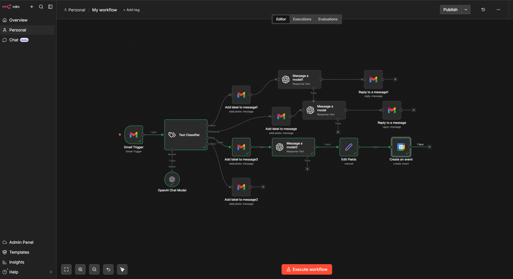

# AI-Powered Email Management Assistant

## Overview

This project demonstrates an email management workflow built using n8n, OpenAI, Gmail, and Google Calendar.

The workflow automatically classifies incoming emails, applies labels, generates contextual responses, and creates calendar events when scheduling information is detected.

## Workflow Architecture

## Features

### Email Classification

* Monitors incoming Gmail messages
* Uses AI to categorize emails
* Routes emails into predefined categories

### Automated Labeling

* Applies Gmail labels automatically
* Improves inbox organization
* Reduces manual email sorting

### AI-Powered Responses

* Generates contextual email replies
* Maintains professional communication
* Reduces repetitive drafting work

### Calendar Automation

* Detects meeting requests
* Extracts scheduling details
* Creates Google Calendar events automatically

## Technology Stack

* n8n
* OpenAI API
* Gmail API
* Google Calendar API

## Business Value

This workflow helps reduce time spent on:

* Email triage
* Inbox organization
* Response drafting
* Meeting scheduling

## Future Enhancements

* Priority scoring
* Sentiment analysis
* Slack/Telegram integration
* CRM integration

## Author

Shriyash Gharote

Built as part of my automation and AI workflow portfolio.
